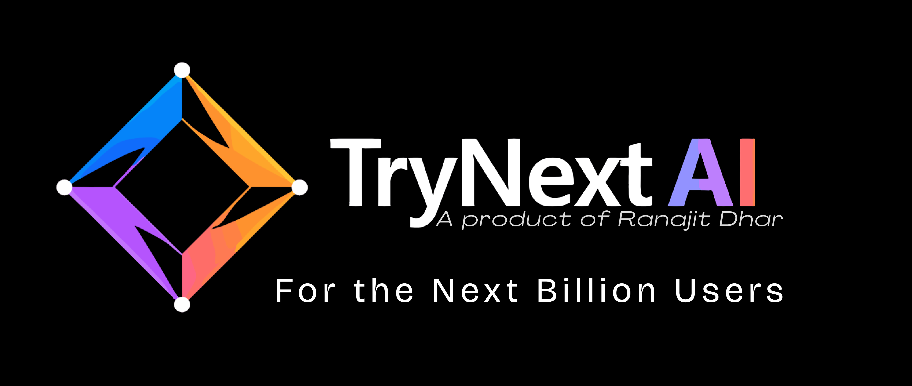
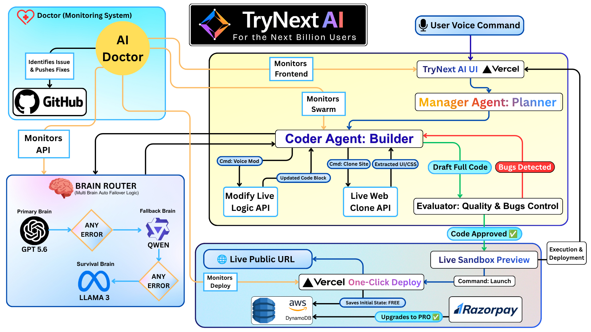
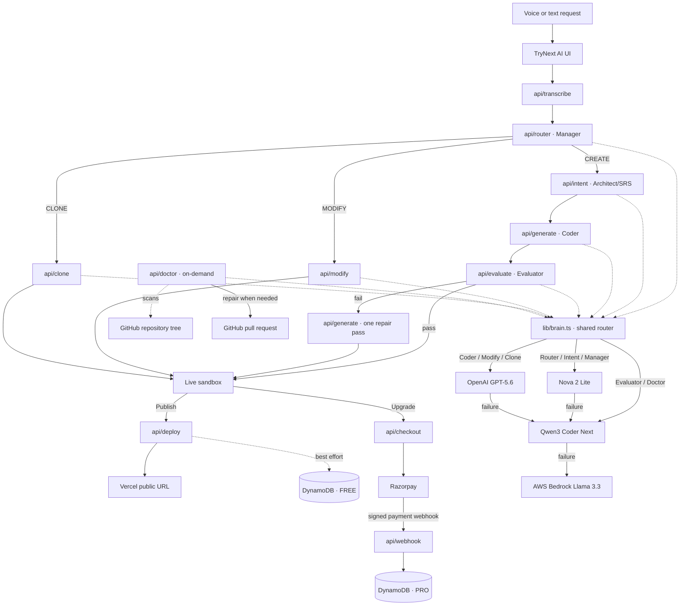

<div align="center">
  

  <h1>TryNext AI</h1>
  <p><strong>Describe an app in your voice. TryNext AI plans it, builds it, evaluates it, and launches it.</strong></p>
  <p>Built for OpenAI Build Week with GPT-5.6 and Codex.</p>

  <p>
    <a href="https://trynextai.vercel.app"></a>
    <a href="https://github.com/ranajitdharpersonal/trynextai"></a>
    <a href="https://youtu.be/taIk6Ld3ndM"></a>
    
    
  </p>
</div>

---

## OpenAI Build Week at a glance

TryNext AI is a **Work & Productivity** project for the OpenAI Build Week challenge. It turns a natural-language or voice request into a working web application, helping founders and teams move from an idea to a testable workflow faster while keeping the build loop observable and recoverable:

```text
Voice request → Manager (route)
                 ├─ CREATE  → Architect (SRS) → Coder → Evaluator → Sandbox
                 ├─ MODIFY  → Modify API ─────────────────────────→ Sandbox
                 └─ CLONE   → Clone API ──────────────────────────→ Sandbox

CREATE failure → one repair pass before the result is shown

Primary tier (role-aware): Nova 2 Lite for routing/planning → GPT-5.6 for code generation → Qwen3 Coder Next for QA/Doctor
Failover tier: the failed request advances to Qwen3 Coder Next → AWS Bedrock Llama 3.3
```

The primary tier is role-aware to control cost without making GPT-5.6 incidental: Nova 2 Lite handles lightweight routing and planning, GPT-5.6 handles code-producing work, and Qwen3 Coder Next handles evaluation and repository repair. A provider failure is recorded and the same request advances through the next available provider, ending at Llama 3.3 when both earlier tiers fail.

**Honest model positioning:** TryNext AI is GPT-5.6-powered for its core code-generation workflow; it is not a claim that GPT-5.6 is the cheapest or first model for every agent. Each role uses the strongest cost-appropriate primary brain, with the same failover protection across the system.

### Why this fits the challenge

| OpenAI Build Week judging lens | Evidence in TryNext AI |
| --- | --- |
| **Technological implementation** | Multi-agent orchestration, structured intent extraction, generated single-file apps, QA scoring, self-healing retries, and provider failover. |
| **Design** | A live sandbox, visible Manager/Coder/Evaluator status, voice input, preview, modification, and one-click deployment. |
| **Potential impact** | Non-technical founders and local-language users can move from an idea to a testable app without learning a programming syntax first. |
| **Quality of the idea** | The product combines voice-to-app generation with an evaluator loop and an on-demand AI Doctor that can open a GitHub repair PR. |

## How GPT-5.6 and Codex were used

**GPT-5.6 runtime:** GPT-5.6 is the primary model for the Coder, Modifier, and Cloner workflows. Nova 2 Lite handles routing and requirement planning, while Qwen3 Coder Next handles QA and repository Doctor tasks. Any failed primary request falls through to Qwen3 Coder Next and then AWS Bedrock Llama 3.3.

**Codex development:** Codex helped shape the Manager -> Architect -> Coder -> Evaluator orchestration, implement the role-aware provider failover adapter, connect the API routes to the UI, and verify the repository workflow. The detailed implementation notes and file-level route map appear below.

## The problem

Software prototyping is still gated by syntax, setup work, and expensive iteration. A person may know exactly what they want to build but still be unable to turn that idea into a working interface.

TryNext AI treats a voice note as the starting point for a software workflow. The goal is not to replace engineering judgment; it is to make the first working version, feedback loop, and deployment path accessible to more people.

<div align="center">
  <h2>🌍 The Mission: Why build for the “Next Billion Users”?</h2>
</div>

> *Imagine millions of people—local shop owners, teachers, visionary students, and non-technical founders—who have brilliant ideas for an app or a website. But the moment they try to build it, they hit a massive brick wall: **coding is hard, and hiring a developer costs thousands of dollars.***
>
> *Does a lack of capital, technical syntax, or **the English language barrier** mean their ideas should die? Should digital innovation only be a privilege for those who speak fluent English and can afford expensive technology agencies?*

<div align="center">
  <h3>💥 I refused to accept that.</h3>
  <p><em>“Can I build a bridge? Can I empower people to build their own dreams without writing a single line of code?”</em></p>
  <p>Coming from a non-technical commerce background, I know firsthand how difficult it can be to turn a digital vision into reality without a developer. That is why TryNext AI is more than an engineering project: it is a personal mission to make software creation a digital equalizer. If you can explain your idea, the system can help you shape, test, and launch it.</p>
  <p><strong>🎙️ I want software architecture to feel as accessible as sending a voice note.</strong></p>
</div>

## What the product does

- **Voice-to-app:** transcribes a request and extracts a structured software requirement.
- **Live transcript preview:** browser interim speech results appear while recording, then Groq Whisper replaces them with the final transcript after capture.
- **Local-language experience:** Whisper keeps the spoken language, returns the detected language, and the browser prefers a matching speech voice for completion feedback when one is installed.
- **Manager agent:** selects CREATE, MODIFY, or CLONE and prepares the build context.
- **Architect agent:** converts a CREATE request into a structured software requirement (SRS) for the Coder.
- **Coder agent:** generates a complete single-file HTML application using Tailwind CSS via CDN and browser `localStorage` where state is needed.
- **Evaluator agent:** on the CREATE path, compares the generated app against the original requirements and returns a pass/fail score with targeted feedback.
- **Self-healing loop:** on the CREATE path, sends failed output and QA feedback back to the Coder for one repair pass before showing the result.
- **Live modification:** accepts follow-up voice instructions against the current app.
- **Web clone workflow:** searches a target site and uses the extracted context as input for a new UI direction.
- **AI Doctor:** performs an on-demand whole-repository diagnostic of tracked source/configuration text files and can create a multi-file GitHub pull request when a repair is required.
- **One-click deployment:** sends the generated app to Vercel and records deployment metadata in DynamoDB.
- **Voice feedback and Brain View:** exposes agent progress in the UI and speaks a completion message back to the user.

## API route map

The following map reflects the current files under `app/api` and the behavior a judge can verify from the repository:

| Route | Responsibility | Current behavior |
| --- | --- | --- |
| `/api/transcribe` | Voice input | Validates the upload, sends it to multilingual Groq Whisper v3 with automatic language detection (or an optional ISO-639-1 hint), and returns transcript language/duration metadata for downstream routing. |
| `/api/router` | Manager | Detects language, translates the success message, and chooses `CREATE`, `MODIFY`, or `CLONE`. |
| `/api/intent` | Architect | Converts a CREATE transcript into a structured SRS: title, description, features, and UI preferences. |
| `/api/generate` | Coder | Generates a raw single-file HTML app; accepts one previous output plus QA feedback for a repair pass. |
| `/api/evaluate` | Evaluator | Scores CREATE output against the SRS. The current prompt evaluates the first 3,000 characters of generated HTML. |
| `/api/modify` | Modifier | Applies a follow-up request to existing HTML and returns the modified HTML directly to the sandbox. |
| `/api/clone` | Cloner | Resolves a site through SerpAPI when needed, fetches up to 80,000 characters of source HTML, and generates a frontend-only clone. |
| `/api/deploy` | Deployment | Injects a 48-hour sandbox-expiry script, deploys `index.html` through the Vercel API, and best-effort writes a FREE record to DynamoDB. |
| `/api/checkout` | Monetization | Creates a Razorpay order for ₹10 with the deployment ID in the order notes. |
| `/api/webhook` | Payment confirmation | Verifies Razorpay's HMAC signature and upgrades the matching DynamoDB record to PRO for 30 days after `payment.captured`. |
| `/api/doctor` | Repository diagnostics | Walks the configured base branch, scans tracked source/configuration text files, asks the model for a repository-level fatal-syntax check, and opens a repair PR only for validated, targeted `oldText` → `newText` patches. Secrets, binaries, generated directories, lockfiles, protected config files, and unsafe/ambiguous repairs are excluded. |

The Doctor fails closed instead of silently performing a partial scan: the current safety limits are 100 scannable files, 160 KB per file, at most 5 targeted patches, 120 changed lines per PR, and 80 deleted lines per patch. If a concern cannot be expressed as a small, unique, high-confidence patch, the route returns `review` and creates no PR.

## Detailed OpenAI implementation notes

The detailed implementation record is included for judges who want to verify how OpenAI and Codex were used.

### Role-aware model routing

`lib/brain.ts` keeps one `askBrain()` contract while assigning the least expensive suitable primary model to each role:

- **Router / Intent / Manager:** Amazon Nova 2 Lite.
- **Coder / Modifier / Cloner:** OpenAI GPT-5.6.
- **Evaluator / AI Doctor:** Qwen3 Coder Next.

If the selected primary provider fails, the same request advances to Qwen3 Coder Next and then AWS Bedrock Llama 3.3. The Bedrock adapter uses the model-agnostic Converse API so Nova, Qwen, and Llama share one normalized response path.

### Codex during development

Codex was used as the engineering co-pilot to:

1. shape the Manager → Architect → Coder → Evaluator orchestration;
2. implement and document the role-aware Nova → GPT-5.6 → Qwen primary tier and Qwen → Llama failover adapter;
3. connect the Next.js UI to intent, generation, evaluation, modification, clone, deploy, payment, and Doctor routes;
4. refactor the generated-app prompt around functional local persistence and accessible UI states;
5. review the repository, debug integration issues, and verify the final setup flow.

The important implementation decisions remain visible in the repository: the agent prompts live under `app/api`, provider routing is isolated in `lib/brain.ts`, and the browser UI renders the state transitions instead of hiding them behind a single loading spinner.

## Architecture

<div align="center">
  
  <br />
  <em>Manager → Architect → Coder → Evaluator, backed by role-aware routing and three-provider failover.</em>
</div>

> **Diagram scope note:** The PNG is a conceptual system overview. In the current implementation, the AI Doctor is an on-demand whole-repository diagnostic route: it scans tracked source/configuration text files from GitHub, asks the model for a repository-level check, and can open a multi-file repair PR only from validated, targeted patches. Secrets, binaries, generated directories, lockfiles, protected configuration files, and unsafe/ambiguous repairs are intentionally excluded. The PNG groups the Architect/SRS step under the Manager for readability, shows Clone/Modify as part of the consolidated Coder path, and shows Razorpay-to-DynamoDB as the signed webhook update.

<details>
<summary>Expand the technical blueprint</summary>


</details>

## Technical implementation notes

### Agent loop

The browser client in `app/page.tsx` coordinates the visible workflow. The Manager first decides whether the request is a build, modification, clone, or other supported action. CREATE requests pass through the Architect/intent route to produce a structured requirement (SRS), then use the Coder and Evaluator. MODIFY and CLONE requests use dedicated routes and currently return their generated HTML directly to the sandbox without a second Evaluator call. On CREATE, if the evaluation fails, the UI performs one repair pass using the previous output and QA feedback before showing the result.

### Model routing

`lib/brain.ts` exposes one `askBrain()` contract for every server route and receives the role being executed:

1. **Role-aware primary tier:** Nova 2 Lite for Router/Intent/Manager, GPT-5.6 for Coder/Modifier/Cloner, and Qwen3 Coder Next for Evaluator/Doctor.
2. **Secondary brain:** Qwen3 Coder Next handles any request whose primary provider fails.
3. **Survival brain:** AWS Bedrock Llama 3.3 handles requests after the earlier providers fail.

The `askBrain()` contract returns `modelUsed`, `modelName`, and `circuitTripped`, making the selected provider and failover path observable to server logs and any route that exposes those fields.

### Safety and scope

Generated applications run in the browser sandbox and are deployed as a single HTML file. The evaluator is a quality gate, not a formal security audit; if every model is unavailable, the route has a failsafe that can bypass QA to keep the UI responsive. The AI Doctor is an on-demand whole-repository diagnostic path, not a claim of continuous autonomous production monitoring. It excludes secrets, binaries, generated directories, lockfiles, and protected configuration files by design. Doctor repairs are patch-only: a unique existing text block must be replaced by a small corrected block within the line budgets; otherwise the API returns a review-only result and creates no PR. External API availability, generated-code quality, and third-party service limits remain real-world constraints.

## Tech stack

- **Application shell:** Next.js 16, React 19, TypeScript, Tailwind CSS, Framer Motion
- **Runtime intelligence:** OpenAI GPT-5.6, Amazon Nova 2 Lite, AWS Bedrock Qwen3 Coder Next, AWS Bedrock Llama 3.3
- **Voice and search:** Groq transcription endpoint, SerpAPI-backed clone workflow
- **Deployment:** Vercel Deployments API
- **Persistence:** AWS DynamoDB
- **Payments:** Razorpay checkout and signed webhook flow
- **Repository automation:** GitHub API for AI Doctor pull requests

## Try the live demo

- **Live app:** [trynextai.vercel.app](https://trynextai.vercel.app)
- **Demo video:** [Watch on YouTube](https://youtu.be/taIk6Ld3ndM)
- **Source code:** [ranajitdharpersonal/trynextai](https://github.com/ranajitdharpersonal/trynextai)

For the required OpenAI Build Week submission video, use a public YouTube recording shorter than three minutes. A strong demo order is:

1. say a concrete app request in a local language or English;
2. show the CREATE path: Manager → Architect → Coder → Evaluator and the generated sandbox;
3. issue one voice modification and show the updated result;
4. deploy the app and show the public URL;
5. briefly explain where GPT-5.6 ran and how Codex helped build the workflow.

> **Submission reminder:** add the [verified current-build YouTube demo](https://youtu.be/taIk6Ld3ndM) to the Devpost project before submitting. The Devpost form also requires the `/feedback` Codex Session ID for the session where most of the core project was built.

## Run locally

### Prerequisites

- Node.js 20+
- npm
- API credentials for the features you want to exercise

### Install and start

```bash
git clone https://github.com/ranajitdharpersonal/trynextai.git
cd trynext-ai
npm install
npm run dev
```

Open [http://localhost:3000](http://localhost:3000).

### Environment variables

Create `.env.local` and add only the credentials needed for your test path. Never commit real values.

```env
# Primary and fallback inference
OPENAI_API_KEY=your_openai_api_key
BEDROCK_AWS_REGION=us-east-1
BEDROCK_AWS_ACCESS_KEY_ID=your_bedrock_access_key
BEDROCK_AWS_SECRET_ACCESS_KEY=your_bedrock_secret_key

# Voice transcription and web clone
GROQ_API_KEY=your_groq_api_key
SERPAPI_API_KEY=your_serpapi_key

# Vercel deployment
TRYNEXT_DEPLOY_KEY=your_vercel_token

# AWS DynamoDB persistence
AWS_REGION=ap-south-1
AWS_ACCESS_KEY_ID=your_aws_access_key
AWS_SECRET_ACCESS_KEY=your_aws_secret_key

# GitHub AI Doctor
GITHUB_TOKEN=your_github_token
GITHUB_USERNAME=your_github_username
GITHUB_REPO=your_github_repository
GITHUB_BASE_BRANCH=main

# Razorpay checkout and webhook verification
NEXT_PUBLIC_RAZORPAY_KEY_ID=your_razorpay_key_id
RAZORPAY_KEY_SECRET=your_razorpay_key_secret
RAZORPAY_WEBHOOK_SECRET=your_razorpay_webhook_secret
```

If a credential is missing, the relevant feature returns an actionable error; the model layer continues through its configured fallback route where possible.

## OpenAI Build Week submission checklist

- [ ] Select **Work & Productivity** as the category.
- [ ] Publish a working project description on Devpost.
- [ ] Add the public repository URL and verify that a clean clone can start from the instructions above.
- [ ] Add the public [YouTube demo](https://youtu.be/taIk6Ld3ndM) under three minutes with audio explaining GPT-5.6 and Codex usage.
- [ ] Add the `/feedback` Codex Session ID requested by the submission form.
- [ ] Confirm the live URL, repository behavior, and demo video all describe the same build.
- [ ] Replace any placeholder credentials or links before submitting.

## Roadmap

- More robust generated-app validation and test fixtures
- Explicit provider health metrics and retry budgets
- Stronger sandbox isolation for generated HTML
- Per-app data stores and a user-facing deployment dashboard
- Native mobile compilation and code-to-design export

## Author

**Ranajit Dhar**

AI & Multi-Agent Systems Architect — pioneering voice-to-software for local languages.

---

TryNext AI is a proof of concept for a more inclusive software workflow: describe the outcome, inspect the generated work, improve it through feedback, and ship when it is ready.
