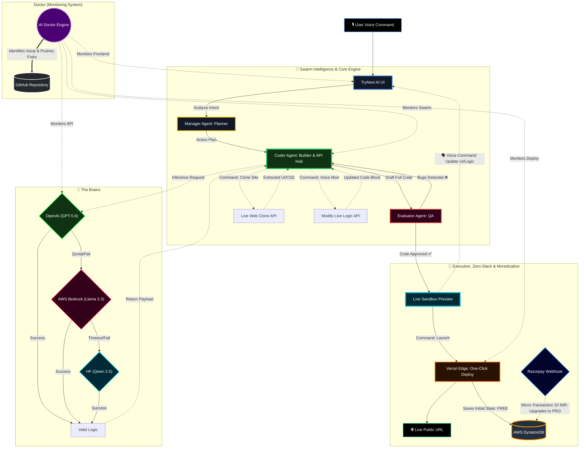

<div align="center">
  
  
  <br><br><p>
  <a href="https://trynext-ai.vercel.app" target="_blank">
    
  </a>
  
  
  
  
  
</p>
  <p><em>Engineered by Ranajit Dhar • Built for the 2026 Developer Ecosystem</em></p>
</div>

---

## 🏆 OpenAI Build Week Hackathon: How We Built with GPT-5.6 & Codex

TryNext AI's core Swarm Intelligence is exclusively powered by OpenAI's frontier models, while the system itself was architected using Codex:
* **GPT-5.6 (The Runtime Swarm):** Our 3-tier agentic architecture (Manager ➔ Coder ➔ Evaluator) is powered entirely by the stable GPT-5.6 API in production. It analyzes voice commands, writes Next.js/Tailwind code, and self-heals logic errors.
* **Codex (The Architect's Co-Pilot):** We strictly followed the "Build with Codex" philosophy. The complex Swarm intelligence logic, the AWS Bedrock circuit breaker, and the Zero-Stack AWS DynamoDB integration you see in this repository were rapidly prototyped, refactored, and tested using the Codex agent via ChatGPT. Codex accelerated our development speed by 10x.

---

## ⚡ Judge TL;DR (30-Second Overview)

**TryNext AI is not just another code generator. It is an autonomous, self-healing software factory.**

We are lowering the barrier to entry for the next billion users by turning **natural voice commands into enterprise-grade web applications.**

* 🌍 **Massive ROI (The Next Billion Users):** A digital equalizer that eliminates the need for expensive dev agencies or CS degrees. Zero coding required—just your voice and a vision.
* 💎 **The "AI Doctor" (Self-Healing):** Continuous live system monitoring that scans your codebase, optimizes logic, and automatically generates direct GitHub Pull Requests (PRs) without breaking core functionality.
* 🎙️ **Voice-to-App & Live Modification:** Speak your idea to build the UI/Logic in real-time, and seamlessly modify the live application purely via continuous voice commands.
* 🌐 **Live Web Clone Engine:** Command the AI to search the live web, inspect popular website architectures, and instantly clone/copy their UI patterns into your project as per your voice prompt.
* 💾 **Zero Stack Data Persistence (AWS DynamoDB):** Built explicitly for the "Hack the Zero Stack" philosophy. Every deployed app's state, premium tier status, and metadata are seamlessly persisted and managed in real-time using AWS DynamoDB, bypassing complex backend provisioning.
* 🚀 **One-Click Public Launch (Powered by Vercel):** Instantly push your generated application from the local sandbox directly to a live, public URL with a single click. We leverage Vercel's edge network to give users a production-ready link in seconds.
* 🤖 **Swarm Intelligence:** A 3-tier agentic architecture powered by OpenAI (`GPT-5.6 Manager ➔ GPT-5.6 Builder ➔ GPT-5.6 Evaluator`) working in perfect sync to eliminate hallucinations.
* 🛡️ **Unbreakable Infrastructure:** Auto-Failover circuit breakers (`OpenAI GPT-5.6 API` ➔ `AWS Bedrock Llama 3.3` ➔ `HF Qwen`) ensure 100% uptime even during API limits.
* 🌍 **Multilingual Intelligence (Breaking the Language Barrier):** TryNext AI supports 100+ local languages. You don't need to know English to build software; speak in your native tongue, and the AI understands the architectural intent.
* 🧠 **Live Brain View & Voice Interaction:** It’s not a silent process. The system provides real-time "Brain View" of the Swarm logic, and once the task is completed, it speaks back to the user with a human-like persona to confirm execution and gather feedback.


---

<div align="center">
  <h2>🌍 The Mission: Why build for the "Next Billion Users"?</h2>
</div>

> *Imagine millions of people—local shop owners, teachers, visionary students, and non-technical founders—who have brilliant ideas for an app or a website. But the moment they try to build it, they hit a massive brick wall: **coding is hard, and hiring a developer costs thousands of dollars.***
> 
> *Does a lack of capital, technical syntax, or **the English language barrier** mean their ideas should die? Should digital innovation only be a privilege for those who speak fluent English and can afford expensive tech agencies?*

<div align="center">
  <h3>💥 I refused to accept that. <i>I asked myself: "Can I build a bridge? Can I empower them to build their own dreams without writing a single line of code?"</i></h3>
  <p>Coming from a non-technical commerce background myself, I know firsthand exactly how hard it is to build a digital vision without a proper developer. And that is how <b>TryNext AI</b> was born. It is not just an engineering marvel; it is a deeply personal mission and a <b>digital equalizer</b>. You don't need a massive budget or a computer science degree anymore. If you can speak your idea, the Swarm can build it. <br><br><b>🎙️ I am making software architecture as accessible as sending a voice note.</b></p>
</div>

---

## 🔥 Core Philosophy (Why TryNext AI Exists)

The traditional software development lifecycle is broken. It is gated by complex syntax, expensive engineering hours, and a steep learning curve. **We are building for the Next Billion Users.**

For a non-technical founder with a brilliant idea, learning React, Next.js, and deployment pipelines is a massive barrier. TryNext AI shatters this barrier by using the most natural interface known to humanity: **The Human Voice.**

| Traditional AI Coding Tools ❌ | 🧠 TryNext AI ✅ |
| :--- | :--- |
| **Complex Backend Setup** | **Zero Stack Data Persistence (AWS DynamoDB)** |
| **Isolated Code Snippets** | **One-Click Public Launch (Vercel Edge)** |
| **Prompt-and-Pray** (Single generation) | **Interactive Sandbox** (Voice-modify the live app) |
| **API Dependency & Crashes** | **Unbreakable Auto-Failover** (GPT 5.6 ➔ Llama ➔ Qwen) |
| **Isolated Snippets** | **One-Click Public Launch** (Direct Vercel edge deployment) |
| **Silent Code Rot** | **AI Doctor** (Continuous system-wide monitoring & Auto-PRs) |
| **Blank Canvas Syndrome** | **Live Web Clone Engine** (Voice-commanded UI extraction) |
| **Language & Interaction**(English Only & Silent) | **100+ Local Languages & Live Voice Feedback** |

---

## 🧬 High-Level Architecture (The Swarm & The Shield)

TryNext AI is powered by a modular, self-healing architecture that guarantees 100% uptime and zero hallucinations. It is divided into three core subsystems:

1. **The Swarm Intelligence (Agentic Loop)**
2. **The Unbreakable Circuit Breaker (LLM Routing)**
3. **The Zero-Stack Deployment Engine (Vercel + AWS DynamoDB) & AI Doctor**

<div align="center">
  
  <br>
  <em>The Multi-Brain Swarm Intelligence & Self-Healing Loop</em>
</div>

<br>

<details>
<summary><h3> <u>Click Here to Expand the Technical Mermaid Blueprint</u></h3></summary>


</details>

### 🎛️ Inside the Architecture:
* **The Manager Agent (Planner):** The strategic brain. It listens to the user's voice transcript, analyzes the core intent, and breaks the project down into an actionable architectural blueprint.
* **The Coder Agent (Builder & API Hub):** The central execution engine. It doesn't just write Next.js 15 + Tailwind CSS code; it actively controls the **Live Web Clone API** to extract UI from external sites and the **Modify API** to inject voice-commanded changes into the live logic.
* **The Evaluator Agent (QA):** The strict gatekeeper. It reviews the Coder's generated application in an isolated loop. If the UI breaks or logic fails, it forces the Coder to rewrite it *before* the user ever sees it in the Sandbox.
* **The Circuit Breaker (Unbreakable LLM Routing):** Ensures the AI never goes down. All inference requests are routed to OpenAI first. If the request fails because of quota limits, timeouts, or service errors, the circuit breaker automatically falls back to Llama 3.3 and finally Qwen 2.5, ensuring uninterrupted service.
* **Interactive Sandbox & Voice Mod:** The generated app runs in a live Next.js sandbox where users can continuously issue new voice commands to tweak the UI or logic in real-time.
* **One-Click Vercel Deployment:** Once satisfied, the sandbox application is pushed directly to Vercel's Edge network, generating a live public URL in seconds. No terminal commands needed.
* **AWS DynamoDB State Management:** App deployment details, user access links, and PRO tier upgrades are instantly verified via Webhooks and stored securely in AWS DynamoDB without spinning up dedicated backend servers.
* **AI Doctor (Global Monitoring System):** Operates globally across the entire ecosystem. It simultaneously monitors the Frontend UI, Swarm Logic, API Health, and Deployment status. If it detects a bug or performance bottleneck, it autonomously generates and pushes a fix via a direct GitHub Pull Request (PR).
* **Voice Feedback & Live Brain View:** Powered by a sophisticated Text-to-Speech (TTS) engine, the system acts like a personal project manager. It talks back to the user upon completion, explaining what it built, while the "Live Brain View" visualizes the real-time thought process of the Swarm agents.

---

## 📊 Enterprise-Grade Observability 

TryNext AI doesn't just generate code; it tracks its own footprint. I have integrated **Vercel Web Analytics** directly into the edge deployment for global observability.

* **Privacy-First Radar:** Monitors global traffic and live sandbox usage without compromising individual user identity (GDPR Compliant).
* **Zero-Latency:** Runs purely on Vercel's Edge Network, ensuring the analytics script never slows down the AI's complex Swarm inference loop.

---

## ⚙️ The Tech Stack (Engineered for Scale)

I didn't just use wrappers; I built a robust, cloud-native architecture.

* **Frontend & Sandbox:**   
* **The Swarm Engine:**   
* **Development Co-Pilot:** 
* **Infrastructure & Database:**   

---

## 🎯 Who is TryNext AI For?

1. **Non-Technical Founders:** Speak your idea, get a live Next.js MVP in seconds.
2. **Senior Developers:** Use the *Clone API* to instantly rip UI structures from the web and bypass boilerplate setup.
3. **The Next Billion Users:** Overcoming the English-syntax coding barrier by allowing natural language voice commands to build complex logic.

---

## 🛣️ The Visionary Roadmap (What's Next?)

TryNext AI is currently a frontend powerhouse with zero-stack deployment capabilities, but the ultimate vision is a **Zero-Touch Full-Stack Factory** paired with a revolutionary, privacy-first business ecosystem.

* 💰 **Privacy-First Monetization & Hash Renewals:** We deliberately avoided clunky traditional user accounts. TryNext AI offers free prototyping, but to unlock 'PRO Auto-Scaling' and secure continuous edge deployment, users pay a highly accessible subscription of just **₹10 per month per app**. In our upcoming release, every app will be assigned a secure, cryptographically unique **Deployment Hash**. Users will simply enter their Hash to securely renew their app's monthly validity, maintaining 100% privacy without forcing them to create accounts.
* 🗄️ **TryNext BaaS (Backend-as-a-Service):** Empowering the end-user's data. We are building an infrastructure where the AI will autonomously provision isolated AWS DynamoDB instances for every single generated app. This will provide our users with a unified dashboard to manage their own customers' data securely, without writing a single line of backend code.
* 📱 **Native App Compilation:** Expanding the Swarm to compile voice commands directly into production-ready iOS and Android binaries (`.apk` / `.ipa`) via React Native.
* 🎨 **Reverse Engineering (Code-to-Figma):** Flipping the industry standard. Instead of designing first and coding later, TryNext AI will generate pixel-perfect Figma design files directly from the voice-generated live code.

---

## 🛠️ Technical Verification (For Judges)

<div align="center">
  <br>
  <a href="https://trynext-ai.vercel.app" target="_blank">
    
  </a>
  <br><br>
  <em>Note: Judges can test the system's full capabilities directly via the Live Edge URL above.<br>This section is strictly for open-source technical verification.</em>
</div>

### 1. Clone & Install
```bash
git clone https://github.com/ranajitdharpersonal/trynext-ai.git
cd trynext-ai
npm install
```

### 2. The Master Keys (`.env.local`)
To run the Multi-Brain Swarm locally, configure the following environment variables:

```env
OPENAI_API_KEY=your_primary_openai_key
GROQ_API_KEY=your_failover_key
HF_TOKEN=your_survival_key
SERPAPI_API_KEY=live_website_search
GITHUB_TOKEN=for_ai_doctor_prs
GITHUB_USERNAME=ranajitdharpersonal
GITHUB_REPO=trynext-ai
TRYNEXT_DEPLOY_KEY=your_secured_vercel_token

# Zero Stack AWS (Database)
AWS_REGION=ap-south-1
AWS_ACCESS_KEY_ID=your_aws_access_key
AWS_SECRET_ACCESS_KEY=your_aws_secret_key
AWS_DYNAMODB_TABLE_NAME=TryNext_Deployments

# AI Engine AWS Bedrock Keys
BEDROCK_AWS_REGION=us-east-1
BEDROCK_AWS_ACCESS_KEY_ID=your_bedrock_access_key
BEDROCK_AWS_SECRET_ACCESS_KEY=your_bedrock_secret_key

RAZORPAY_WEBHOOK_SECRET=your_webhook_secret
```
(Security Note: The Vercel deployment token is secured under a custom namespace TRYNEXT_ to bypass default cloud system restrictions and prevent environment clashes).

### 3. Ignite the Engine
```Bash
npm run dev
```

---

## 👨‍💻 The Architect

**Ranajit Dhar**
* *AI & Multi-Agent Systems Architect | Pioneering Voice-to-Software for Local Languages*
* **Copyright (c) 2026 Ranajit Dhar.**

**⭐ Final Note:**
> TryNext AI is not just a tool; it is a proof-of-concept for a future where anyone, regardless of their coding ability, can architect software using just their voice. 
> <br><br>**Welcome to the next generation of software development.**
